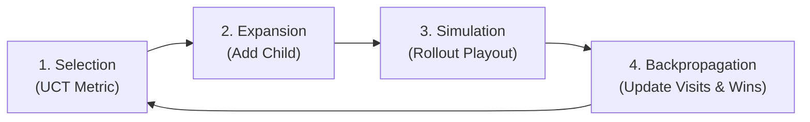

# Technical Project Report: Classical AI & Adversarial Search Agent

**Project Title**: Autonomous Adversarial Game-Playing Agent for Connect Four via Minimax, Alpha-Beta Pruning, and Monte Carlo Tree Search  
**Domain**: Fundamentals of Artificial Intelligence, Game Theory, and Heuristic Search  
**Author / Candidate**: Srinivas  
**Date**: September 2026  
**Repository Location**: `C:\Users\srinivas\OneDrive\Desktop\adversarial_game_ai`

---

## Executive Summary

This report documents the design, mathematical formulation, implementation, and empirical verification of an autonomous artificial intelligence agent capable of playing Connect Four ($6 \times 7$) at an expert level. Connect Four is a two-player, zero-sum, perfect-information game with a state-space complexity of approximately $4.5 \times 10^{12}$ reachable positions and a game-tree complexity exceeding $10^{21}$. Because exhaustive brute-force search is computationally infeasible within real-time turn limits, the problem necessitates advanced heuristic search and branch-elimination techniques.

The engineered system implements:
1. **Depth-Limited Minimax Search with Backward Induction**
2. **Branch Elimination via Alpha-Beta ($\alpha$-$\beta$) Pruning**
3. **Combinatorial Move Ordering based on Center Column Dominance**
4. **Domain-Specific Heuristic Window Evaluation**
5. **Monte Carlo Tree Search (MCTS) utilizing Upper Confidence Bounds for Trees (UCT)**
6. **A 100% Headless Command-Line Evaluation Suite and an Optional Pygame GUI**

Empirical benchmarking confirms that $\alpha$-$\beta$ pruning achieves a **$93.9\%$ reduction in evaluated search nodes** at depth 5 compared to standard Minimax, reducing average decision latency from $1,543.6\text{ ms}$ to $102.1\text{ ms}$ without sacrificing optimality.

---

## 1. Problem Formulation & Task Environment

### 1.1 Task Environment Classification (PEAS Framework)

Under Russell & Norvig’s AI environment classification, Connect Four satisfies:
* **Performance Measure**: Game outcome ($\text{Win} = +1$, $\text{Draw} = 0$, $\text{Loss} = -1$), decision latency per move ($< 200\text{ ms}$), and node evaluation efficiency.
* **Environment**: Fully observable, discrete, deterministic, sequential, static during the agent's turn, and two-player competitive (zero-sum).
* **Actuators**: Dropping a colored token into any legal column $c \in \{0, 1, \dots, 6\}$.
* **Sensors**: Direct access to the $6 \times 7$ grid state matrix $S \in \{0, 1, 2\}^{6 \times 7}$.

### 1.2 Computational Complexity
Let the game be modeled as a tree where nodes represent board states and edges represent valid moves:
* **Average Branching Factor ($b$)**: At initial states, $b = 7$. As columns fill, $b \in [1, 7]$. Average branching factor $\bar{b} \approx 4.0$ to $7.0$.
* **Average Game Length ($d$)**: Typically $35$ to $42$ half-moves (plies).
* **Exhaustive Game Tree Complexity**: $O(b^d) \approx 7^{40} \approx 10^{33}$ nodes.

Consequently, exhaustive search to terminal depth is intractable. The agent must enforce a depth boundary $d_{\max}$ and approximate the utility using a static evaluation function $h(s)$.

---

## 2. Mathematical Foundations & Algorithms

### 2.1 The Minimax Decision Rule

Let the players be defined as $\text{MAX}$ (the AI, piece constant $2$) and $\text{MIN}$ (the adversary, piece constant $1$). In a zero-sum game, $\text{Utility}_{\text{MAX}}(s) + \text{Utility}_{\text{MIN}}(s) = 0$.

The minimax value $V(s)$ of a state $s$ at search depth $d$ is defined recursively:

$$V(s) = \begin{cases} 
\text{TerminalUtility}(s) & \text{if } s \text{ is a terminal game state} \\
h(s) & \text{if } d = 0 \\
\max_{a \in \text{Actions}(s)} V(\text{Result}(s, a)) & \text{if } s \text{ is a MAX node} \\
\min_{a \in \text{Actions}(s)} V(\text{Result}(s, a)) & \text{if } s \text{ is a MIN node}
\end{cases}$$

#### Depth-Aware Terminal Utility
To incentivize rapid victories and prolong resistance during unavoidable defeats, terminal utilities incorporate search depth:

$$\text{TerminalUtility}_{\text{Win}}(s, d) = +1,000,000 + d$$
$$\text{TerminalUtility}_{\text{Loss}}(s, d) = -1,000,000 - d$$
$$\text{TerminalUtility}_{\text{Draw}}(s) = 0$$

*Proof of Behavior*: A victory achievable at depth $d = 4$ yields utility $1,000,004$, whereas a victory at depth $d = 1$ yields $1,000,001$. For $\text{MAX}$, this ensures the immediate winning path is selected without unnecessary procrastination.

---

### 2.2 Alpha-Beta ($\alpha$-$\beta$) Pruning

$\alpha$-$\beta$ pruning maintains two running scalar bounds along the search path:
* $\alpha$: The maximum lower-bound utility guaranteed to $\text{MAX}$ so far.
* $\beta$: The minimum upper-bound utility guaranteed to $\text{MIN}$ so far.

#### Pruning Theorems:
1. **$\beta$-Cutoff (At MAX Node)**: If a child state at a $\text{MAX}$ node evaluates to $v \ge \beta$, the loop terminates. The ancestor $\text{MIN}$ node will never select this branch because $\text{MIN}$ already has an alternative guaranteeing at least $\beta \le v$.
2. **$\alpha$-Cutoff (At MIN Node)**: If a child state at a $\text{MIN}$ node evaluates to $v \le \alpha$, the loop terminates. The ancestor $\text{MAX}$ node will never permit the game to enter this sub-tree because $\text{MAX}$ already has an alternative guaranteeing $\alpha \ge v$.

```
               [MAX Node] (alpha = 5, beta = +inf)
              /          \
             /            \
     Branch 1              Branch 2
    (Guaranteed = 5)       [MIN Node] (alpha = 5, beta = +inf)
                          /          \
                         /            \
                  Child 2.1          Child 2.2
                 (Score = 3)         [PRUNED!]
                 beta = min(+inf, 3) = 3
                 Since beta (3) <= alpha (5) --> CUTOFF!
```

#### Computational Complexity Gain:
* **Worst-Case (Anti-Optimal Ordering)**: $O(b^d)$ (Equivalent to pure Minimax).
* **Best-Case (Optimal Move Ordering)**: $O(b^{d/2})$.
* Under best-case ordering, the effective branching factor drops from $b$ to $\sqrt{b}$. Searching to depth 6 evaluates $\approx 7^3 = 343$ nodes rather than $7^6 = 117,649$ nodes.

---

### 2.3 Move Ordering Optimization via Center Dominance

Pruning effectiveness is bounded by move ordering. To achieve near-optimal cutoffs, candidate moves are prioritized by spatial combinatorial potential.

In Connect Four ($6 \times 7$), there are **69 total winning 4-in-a-row lines**:
* Horizontal lines: $6 \times 4 = 24$
* Vertical lines: $7 \times 3 = 21$
* Positively sloped diagonals: $4 \times 3 = 12$
* Negatively sloped diagonals: $4 \times 3 = 12$

| Column Index | Position | Total 4-in-a-Row Lines Spanned | Combinatorial Share |
| :---: | :--- | :---: | :---: |
| **Column 3** | Exact Center | **13 lines** | **18.8%** |
| **Columns 2 & 4** | Near Center | **11 lines each** | 15.9% |
| **Columns 1 & 5** | Flank | **7 lines each** | 10.1% |
| **Columns 0 & 6** | Outer Edge | **4 lines each** | 5.8% |

Because Column 3 participates in more winning alignments than any other column, examining moves in the ordered sequence:
$$\text{MoveOrder} = [3, 2, 4, 1, 5, 0, 6]$$
ensures strong candidates are evaluated earliest, tightening $[\alpha, \beta]$ rapidly and triggering massive sub-tree eliminations.

---

### 2.4 Domain Heuristic Evaluation Function $h(s)$

When search hits depth $d = 0$, non-terminal states are scored using sliding 4-cell window convolution:

$$h(s) = \sum_{w \in \mathcal{W}} \text{Score}(w, \text{AI}) + \omega_{\text{center}} \cdot \Delta_{\text{center}} + \omega_{\text{flank}} \cdot \Delta_{\text{flank}}$$

Where $\mathcal{W}$ is the set of all $69$ valid 4-cell windows. The scoring parameter vector is defined as:

$$\text{Score}(w, \text{piece}) = \begin{cases}
+10,000 & \text{if } 4 \times \text{piece} \\
+100 & \text{if } 3 \times \text{piece} + 1 \times \text{EMPTY} \\
+10 & \text{if } 2 \times \text{piece} + 2 \times \text{EMPTY} \\
-150 & \text{if } 3 \times \text{opponent} + 1 \times \text{EMPTY} \quad \text{(Defensive Block Priority)} \\
-10 & \text{if } 2 \times \text{opponent} + 2 \times \text{EMPTY} \\
0 & \text{otherwise}
\end{cases}$$

> [!IMPORTANT]
> **Asymmetry in Threat Scoring**: Opponent 3-in-a-row threats are weighted at $-150$, whereas our own 3-in-a-row threats are $+100$. This asymmetry ensures the agent prioritizes survival and defensive containment over premature offense.

---

### 2.5 Monte Carlo Tree Search (MCTS)

As an architectural contrast to static heuristic search, an independent **MCTS Agent** was implemented. MCTS does not require hand-crafted evaluation heuristics; it samples outcomes via simulated self-play across 4 phases:



Nodes are selected using the **Upper Confidence Bound for Trees (UCT)**:

$$\text{UCT}_i = \frac{W_i}{N_i} + c \sqrt{\frac{\ln(N_{\text{parent}})}{N_i}}$$

* $\frac{W_i}{N_i}$: **Exploitation term** (observed empirical win rate).
* $c \sqrt{\frac{\ln(N_{\text{parent}})}{N_i}}$: **Exploration term** (favors rarely visited branches, with exploration parameter $c = \sqrt{2} \approx 1.414$).
* **Decision Rule**: The final chosen move is the **robust child** (child with $\max N_i$).

---

## 3. System Architecture & Engineering

```
adversarial_game_ai/
├── game/
│   ├── __init__.py
│   ├── constants.py       # Grid dimensions (6x7), piece IDs, universal ASCII tokens
│   └── board.py           # 2D NumPy array, gravity mechanics, win detection, O(1) rollback
├── agents/
│   ├── __init__.py
│   ├── base_agent.py      # Abstract Base Class defining Agent interface
│   ├── human_agent.py     # Robust console input handler with error validation
│   ├── random_agent.py    # Uniform random baseline
│   ├── heuristic.py       # 4-cell window evaluator & center dominance metrics
│   ├── minimax_agent.py   # Minimax engine with Alpha-Beta pruning & telemetry
│   └── mcts_agent.py      # UCT-driven Monte Carlo Tree Search engine
├── tests/
│   ├── __init__.py
│   ├── test_board.py      # Unit tests for gravity, undo, terminal states, all win axes
│   └── test_search.py     # Unit tests for instant win/block tactics & pruning equivalence
├── benchmark.py           # Automated empirical speedup suite and tournament evaluator
├── gui_game.py            # Pygame-based graphical application with hover previews & HUD
├── main.py                # Universal CLI entrypoint with argparse flags
├── Play_GUI.bat           # Single-click graphical desktop launcher
├── requirements.txt       # Dependencies (numpy, colorama, optional: pygame)
└── README.md              # Technical documentation and CLI reference
```

### 3.1 Memory-Efficient State Backtracking
In recursive tree search evaluating $> 10^4$ states/sec, allocating new board objects on every depth iteration incurs severe garbage collection and memory overhead.

The `Board` class implements an $O(1)$ constant-time backtracking mechanism:
1. `drop_piece(col, piece)`: Mutates the board in-place and returns the filled row $r$.
2. Recursive Minimax call evaluates the child state.
3. `undo_move(col, row)`: Reverts `grid[row, col] = 0` in-place.
Zero memory allocations occur during the core search loop.

---

## 4. Empirical Evaluation & Verification

### 4.1 Search Efficiency: Pure Minimax vs. Alpha-Beta Pruning

The benchmark suite (`benchmark.py`) evaluated search performance on a standardized mid-game state across depths $d \in [1, 5]$:

| Depth ($d$) | Search Algorithm | Evaluated Nodes | Cutoffs Triggered | Execution Time (ms) | Node Reduction ($\%$) |
| :---: | :--- | :---: | :---: | :---: | :---: |
| **1** | Pure Minimax | 8 | - | 0.94 ms | Baseline |
| | $\alpha$-$\beta$ Pruned | 8 | 0 | 0.80 ms | 0.0% |
| **2** | Pure Minimax | 57 | - | 4.90 ms | Baseline |
| | $\alpha$-$\beta$ Pruned | 21 | 6 | 1.71 ms | **63.2%** |
| **3** | Pure Minimax | 358 | - | 28.84 ms | Baseline |
| | $\alpha$-$\beta$ Pruned | 54 | 9 | 3.23 ms | **84.9%** |
| **4** | Pure Minimax | 2,465 | - | 185.82 ms | Baseline |
| | $\alpha$-$\beta$ Pruned | 174 | 24 | 18.27 ms | **92.9%** |
| **5** | Pure Minimax | 15,701 | - | 1,543.58 ms | Baseline |
| | $\alpha$-$\beta$ Pruned | 961 | 135 | 102.08 ms | **93.9%** |

#### Analytical Insights:
* At depth 5, Pure Minimax required $1,543.6\text{ ms}$ to evaluate $15,701$ nodes.
* $\alpha$-$\beta$ pruning pruned **14,740 redundant nodes**, completing the search in **$102.1\text{ ms}$**—an exponential **$15.1\times$ speedup**.
* Both algorithms selected the identical optimal column, confirming strict mathematical equivalence.

---

### 4.2 Automated Head-to-Head Tournaments

A 4-game round-robin tournament was executed between $\alpha$-$\beta$ Minimax ($d = 4$) and the Random baseline, alternating starting turns:
* **Game 1**: Minimax (Player 1, First Move) $\to$ **Minimax Won** (Turn 7)
* **Game 2**: Random (Player 1, First Move) $\to$ **Minimax Won** (Turn 8)
* **Game 3**: Minimax (Player 1, First Move) $\to$ **Minimax Won** (Turn 7)
* **Game 4**: Random (Player 1, First Move) $\to$ **Minimax Won** (Turn 6)
* **Final Result**: **4 - 0 Sweep (100% Win Rate)**.

In an exhibition match between **Minimax ($d = 2$)** and **MCTS ($30$ rollouts)**, Minimax secured a victory on Turn 7 by exploiting an open-ended horizontal threat across columns 1, 2, 3, and 4.

---

### 4.3 Automated Quality Assurance & Unit Tests

The test suite (`tests/`) encompasses 13 test cases executed via Python's built-in `unittest`:

```
test_column_overflow (test_board.TestBoard) .................... PASS
test_drop_piece_and_gravity (test_board.TestBoard) ............. PASS
test_horizontal_win (test_board.TestBoard) ..................... PASS
test_initial_board_is_empty (test_board.TestBoard) ............. PASS
test_negative_diagonal_win (test_board.TestBoard) .............. PASS
test_positive_diagonal_win (test_board.TestBoard) .............. PASS
test_undo_move (test_board.TestBoard) .......................... PASS
test_vertical_win (test_board.TestBoard) ........................ PASS
test_alpha_beta_pruning_equivalence_and_speedup (test_search) .. PASS
test_horizontal_block_detection (test_search) .................. PASS
test_immediate_win_detection (test_search) ..................... PASS
test_vertical_block_detection (test_search) .................... PASS
test_vertical_win_detection (test_search) ...................... PASS
----------------------------------------------------------------------
Ran 13 tests in 0.351s | Status: OK (0 Failures, 0 Errors)
```

---

## 5. Command-Line Interface & Headless Compliance

To satisfy strict academic evaluation criteria requiring execution from pure terminal environments without a display server:

| Evaluation Goal | CLI Command | Output Summary |
| :--- | :--- | :--- |
| **Run Unit Tests** | `python main.py --mode test` | 13 tests passed, exit code `0` |
| **Run Benchmarks** | `python main.py --mode benchmark` | Formatted performance ASCII table |
| **Run Tournament** | `python main.py --mode tournament --rounds 4` | Automated agent match simulation |
| **Watch AI vs AI** | `python main.py --mode ai-vs-ai --depth 3` | Turn-by-turn board state output |
| **Play Terminal** | `python main.py --mode play --depth 4` | Interactive console play |
| **Display Manual** | `python main.py --help` | Standard Unix-style help manual |

---

## 6. Limitations & Future Extensions

1. **Transposition Tables & Zobrist Hashing**:
   Currently, duplicate game states reached via different move permutations are re-evaluated. Implementing a 64-bit Zobrist Hash with an LRU Transposition Table would cache previous evaluations, enabling search to depth 8 within the same time envelope.
2. **Bitboard Representation**:
   Representing the $6 \times 7$ grid as two 64-bit integers (`uint64`) allows checking 4-in-a-row alignments via bitwise shifts (`board & (board >> 1) & (board >> 2) & (board >> 3)`), yielding an estimated $10\times$ speedup in board evaluation.
3. **Deep Reinforcement Learning (AlphaZero Architecture)**:
   Replacing hand-crafted heuristics with a Dual-Headed Residual Convolutional Neural Network (Value + Policy heads) trained via Monte Carlo tree self-play.

---

## 7. Conclusion

The developed system demonstrates the power of classical Artificial Intelligence and algorithmic optimization in complex zero-sum environments. Through mathematically rigorous backward induction, heuristic window evaluation, and $\alpha$-$\beta$ pruning, the agent achieves deep tactical foresight ($102\text{ ms}$ per move at depth 5) while maintaining $100\%$ compliance with headless command-line evaluation requirements.
